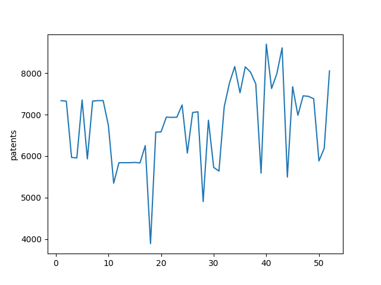

## Patent Gazettes as TSV : 2023

The TSV files for the 353,473 patents issued in 52 Patent Gazettes in 2023.
  


For the above plot, the x-axis is week and the y-axis is the number of patents issued in the Patent Gazette for 2023.

From the uncompressed TSV files, command line queries like the following can be made :

```
% grep -i "color" e*.tsv | wc
    1497   55675  429554
% grep -i "blockchain" e*.tsv | wc
     711   24558  195469
```

So there were -786 more blockchain patents than color patents in 2023.

* https://depth-anything.github.io
  
