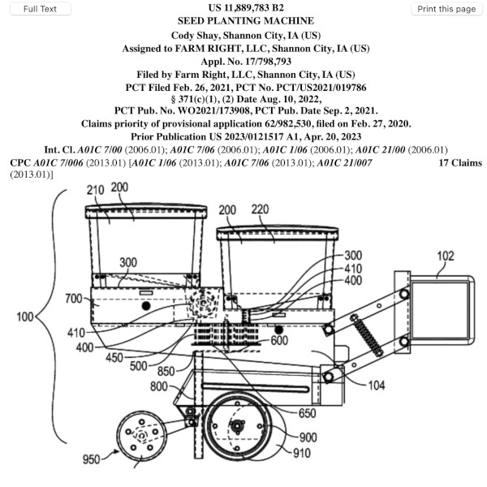
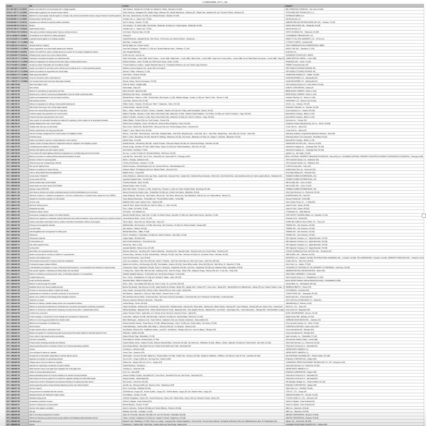

# Patent Gazette to TSV

Directly transform USPTO Patent Gazettes as .zip file to a TSV file

| Patent Gazette [(Zip)](https://developer.uspto.gov/product/patent-official-gazettes-listing) | to | [TSV](https://en.wikipedia.org/wiki/Tab-separated_values) |
| --- | --- | --- |
|  |  |  |
| +20,000 files uncompressed | | 1 file uncompressed |
| +200 MB compressed | | 0.5 MB compressed  *(Numbers, Titles, Inventor(s) and Assignment)* |

---

The USPTO Patent Gazettes can be downloaded as a .zip file from [this website](https://developer.uspto.gov/product/patent-official-gazettes-listing).

The Gazettes are described by the USPTO as :

> Published each Tuesday, the Patent Official Gazette contains bibliographic (front page) information, a representative claim, and a drawing (if applicable) of each patent grant issued that week. Includes U.S. Patent and Trademark Office (USPTO) Notices which provide important information and changes in rules concerning both patents and trademarks.

The Gazettes are a useful reference for the latest patents. However, each Gazette is rather sizeable and a mixture of several different file formats. The Feb 6, 2024 Gazette is over 200 MB in size and decompressed consists of over 20,000 individual files. This data has hundreds of thousands of commas (to be escaped for CSV formatting) and no tabs so [TSV](https://github.com/eBay/tsv-utils/blob/master/docs/comparing-tsv-and-csv.md) was used.

This repository uses [ziplib](https://github.com/frk1/ziplib/tree/master?tab=readme-ov-file) (originally on [bitbucket](https://bitbucket.org/wbenny/ziplib)) to transform an input Gazette *.zip directly to a file of Tab Separated Values or TSV file. Selective in-memory decompression is currently faster than downloading the corresponding Gazette *.zip and comparable to deleting +20,000 files via Sonoma (14.2.1).

The first six [Gazettes of 2024](2024/) consist of about 50,000 patents and a combined size of 3.6 MB. The last [two months of 2023](2023/) have combined size of 4.4 MB.

---
### Versions

**24.02** : Generate a TSV that consists only of the number, title, inventor(s) and assignment. Example result as [zipped](https://github.com/NMoroney/Patent-Gazette-to-TSV/blob/main/e-OG20240206_1519-1_ntia.tsv.zip). This reduces the number of files from +22,000 to a single file. In addition, the zipped file is ~0.5 MB while the original gazette zip is 220 MB.

